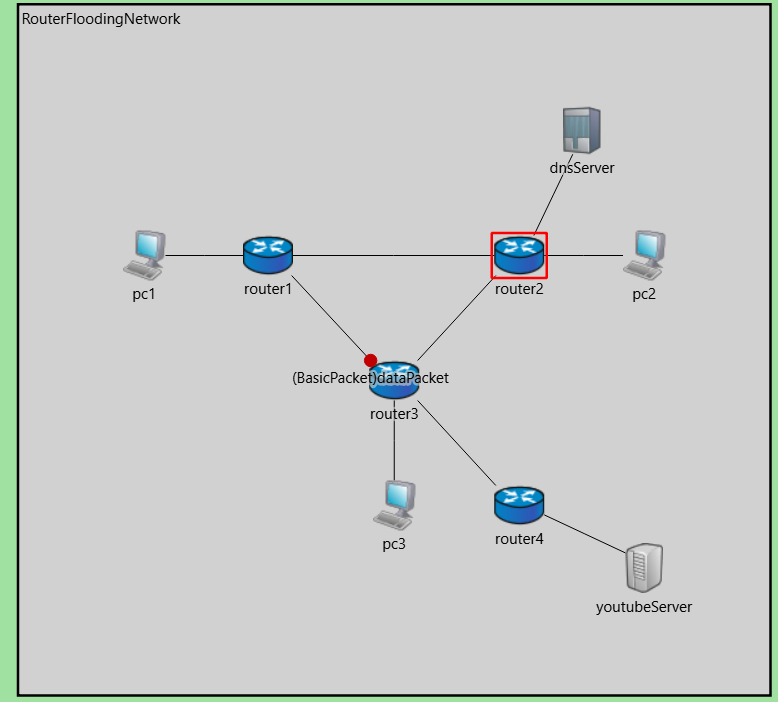

# 🌐 Router Flooding & Learning Capability Simulation (with DNS Integration)


---

## 🚀 Project Overview

This project simulates an intelligent **Router Flooding and Learning mechanism** integrated with a **DNS (Domain Name System)** module using **OMNeT++** and **C++**.

The goal is to demonstrate how a router can dynamically **learn optimal forwarding paths** while resolving DNS queries efficiently.  
It combines **link-layer flooding**, **learning switch logic**, and **DNS name resolution**—showing how real-world networks can adapt and optimize communication.

---

## 🧠 Protocol Background

### 🔹 Existing Problem
Traditional **flooding protocols** in network layers blindly broadcast packets to all neighbors — causing:
- High network congestion  
- Redundant transmissions  
- Inefficient resource usage  

Similarly, in DNS resolution, repeated requests for the same hostname cause **unnecessary lookups** and **latency**, as routers lack memory of learned mappings.

### 🔹 Our Approach
This project extends the base flooding mechanism by adding:
1. **Learning Capability** – Routers store source-destination mappings (like MAC tables in Ethernet switches).  
2. **Flooding** – Once learned, packets are sent directly to the correct neighbor, not broadcast everywhere.  
3. **DNS Caching Integration** – DNS server maintains query–IP mappings, reducing future lookup time.  

This approach results in a network that **learns from traffic**, reducing delay and bandwidth usage over time.

---

## ⚙️ Implementation Architecture

The project contains four core simulation modules:

| Module | Description |
|--------|--------------|
| `Router.cc` | Implements the flooding + learning mechanism. Stores forwarding table entries dynamically. |
| `DNS.cc` | Handles DNS query messages (`DNSRequest`, `DNSReply`) and caches name–IP pairs. |
| `PC.cc` | Simulates end hosts that generate DNS and data packets. |
| `Link.cc` | Connects routers and PCs, forwarding packets according to the OMNeT++ NED topology. |

---


🧾 **Explanation:**
- Defines network topology and runtime.
- Assigns IDs automatically to routers and PCs.
- Saves simulation outputs in `/results`.
- Provides two simulation modes: *BasicTest* and *ExtendedTest*.

---

## 📁 File Structure

```
📦 RouterFloodingLearningCapability
 ┣ 📜 README.md
 ┣ 📜 omnetpp.ini
 ┣ 📂 src/
 │  ┣ 📜 Router.cc
 │  ┣ 📜 DNS.cc
 │  ┣ 📜 PC.cc
 │  ┣ 📜 Link.cc
 │  ┗ 📜 messages.msg
 ┣ 📂 ned/
 │  ┗ 📜 RouterFloodingNetwork.ned 
 │  
 ┗ 📂 demo/
    
```

---

## 🧑‍💻 How to Run the Simulation

### 🧱 Requirements
- **OMNeT++ 6.2.0+**
- **C++17 Compiler** (Clang or GCC)

---

## 📸 Simulation Demo


<p align="center">
  
</p>

<p align="center">
  
</p>

🧩 The animation shows:
- Initial packet flooding  
- Gradual router learning  
- Efficient direct forwarding  
- DNS name resolution and caching  

---

## 🧠 Key Learnings

- Understanding **flooding vs. learning switch** behavior  
- Simulating **control plane intelligence** in OMNeT++  
- Integrating **DNS protocol logic** with packet forwarding  
- Managing simulation configurations and outputs  

---

## 🏁 Future Improvements

- Add **packet loss and delay metrics**  
- Introduce **dynamic topology changes**  
- Implement **ARP and ICMP integration**  
- Visualize **learning tables** dynamically in GUI  

---

## 🧾 License

This project is distributed under the **Academic Public License** (APL) — same as OMNeT++.

---

## 👨‍💻 Author

**Md Tashibul Islam**  
Department of Computer Science and Engineering  
Khulna University of Engineering and Technology  
📧islam2007011@stud.kuet.ac.bd


---

## 🌟 Acknowledgment

Special thanks to **OMNeT++**, **INET Framework**, and open academic resources that guided the simulation design and validation.

---
